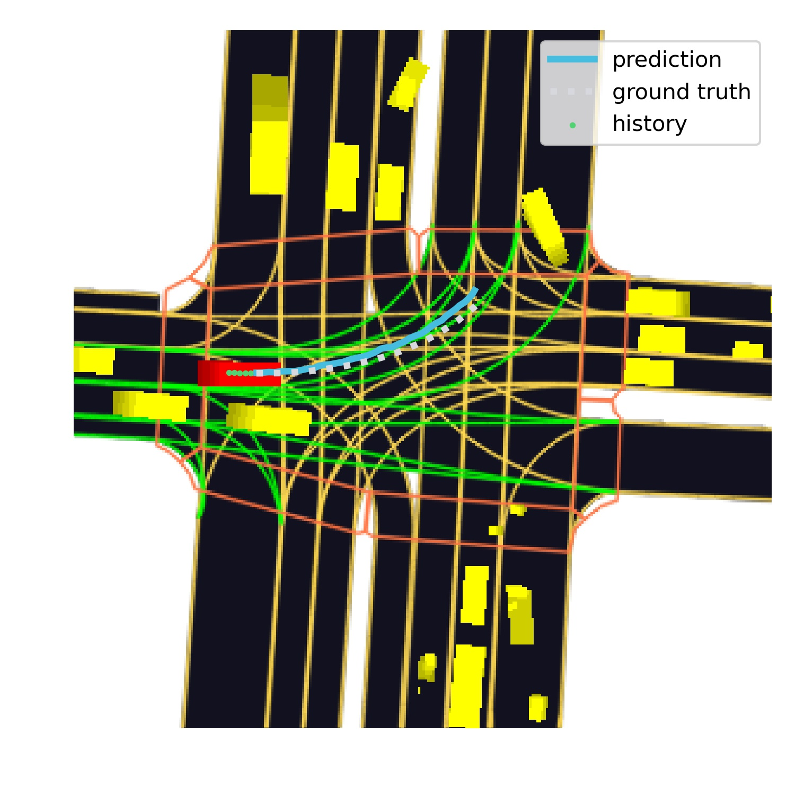
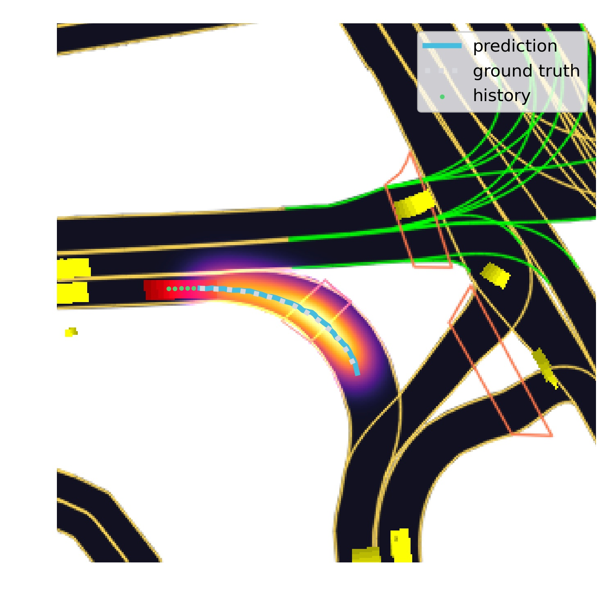
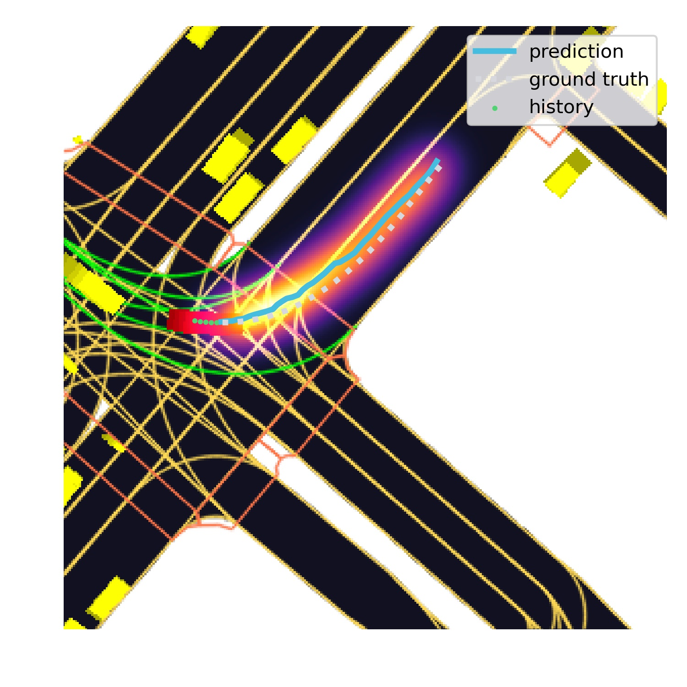

# Scene-Compliant GAN for Movement Predictions of Traffic Actors

### This repository contains implementation of <a href="https://arxiv.org/abs/2004.06247">"Improving Movement Predictions of Traffic Actors in Bird’s-Eye View Models using GANs and Differentiable Trajectory Rasterization"</a> article (PyTorch). 

### <a href="https://github.com/d-eremeev/">Dmitry Eremeev</a>, <a href="https://github.com/alexeypustynnikov">Alexey Pustynnikov</a>

## Main ideas:

The authors of the paper consider the task of predicting future movement of traffic actors. 

They propose a novel **Scene-Compliant GAN** solution which relies on *Wassertein GAN with Gradient Penalty*. Usage of tracked actor's state (trajectory and yaws) over the past L timestamps along with rasterized scene image allows trained network to generate future positions for a target actor.

There's a fully convolutional DCGAN as Discriminator with **Differentiable Rasterizer** added to simplify
the discriminator’s job. Authors suggest to fuse past observed states of the actor to discriminator using the 2D Fusion method proposed in https://arxiv.org/abs/1906.08469.

Authors claim that SC-GAN outperforms the existing state-of-the-art generative approaches.

## Architecture:

## Implementation details
- We use a part of Lyft Level 5 Prediction dataset from <a href="https://github.com/lyft/l5kit">l5kit</a> package for training and validation. One can easily get this dataset from <a href="https://www.kaggle.com/c/lyft-motion-prediction-autonomous-vehicles/data">Kaggle</a>.
- Initially we use a built-in <a href="https://github.com/lyft/l5kit">l5kit</a> rasterizer to generate a sequence of images for ego-car and agents, as well as images for a scene in different channels. Then we apply custom rasterizer to produce a single RGB image for a scene, as mentioned in article.
- We select only moving (**non-static**) cars for prediction. This is achieved by passing a custom mask to l5kit dataset class. We consider cars which drove less than 5 meters over past second to be static.
- We haven't included velocities in actor states since they were not available in the l5kit's early versions. To handle this we made it possible to use 1D convolutions with LSTM in encoder. The velocities should be added in later version of the package.
- **Warning!** If one is planning to use later version of <a href="https://github.com/lyft/l5kit">l5kit</a>, he/she should consider all modifications in l5kit. We can specify 2 major changes affecting our project:
  1. There were some troubles with rotation angle for history/target positions in l5kit dataset which required additional change of coordinates in code. This transformation should be included in later versions of l5kit, which leads to small changes in `transform` method of `TransformDataset` class.  
  2. l5kit team tends to change config file structure over time so one should keep it in mind. 

## Example

  

## Differentiable Rasterizer Visualization

  </img></img>

## Animated Examples

</img></img></img>

## Files description

  1) **cfg.yaml** - config for running a model. We use <a href="https://github.com/facebookresearch/hydra">Hydra</a> as config manager.
  2) **layers.py** - contains all layers required for the model including Differentiable rasterizer.
  3) **losses.py** - contains loss functions for training and validation. 
  4) **train.py** - main file with training loop and validation.
  5) **utils.py** - various auxiliary functions.
  
 ## Training procedure
  1) Download dataset
  2) Create masks if necessary
  3) Fill in the config file with corresponding parameters and paths
  4) Run **train.py**
